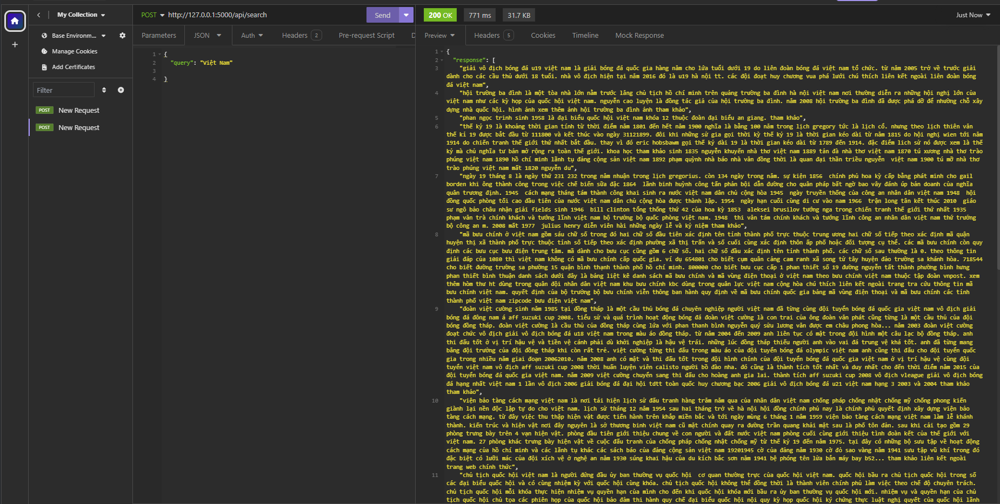

## I. Set up
### Installation

```
pip install -r requirements.txt
```

### Run server

```
python serve.py
```

### Test API

```
curl -X POST http://127.0.0.1:5000/api/search -H "Content-Type: application/json" -d '{"query": "Việt Nam vững mạnh"}'

```

## II. Set up data

This project utilized [ILT37/viwiki](https://huggingface.co/datasets/ILT37/viwiki)

```python
from datasets import load_dataset
load_dataset('ILT37/viwiki', split='train')

```
## III.
### 1. Raw Search (TF-IDF)


### 2. Search Index (FAISS)

[Faiss](https://github.com/facebookresearch/faiss)

Add [Search index](https://huggingface.co/docs/datasets/faiss_es)

## IV. Test



